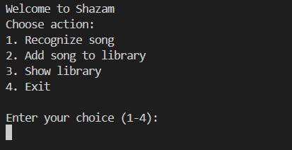
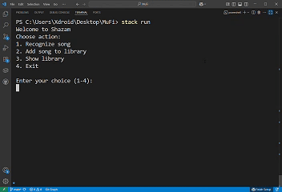
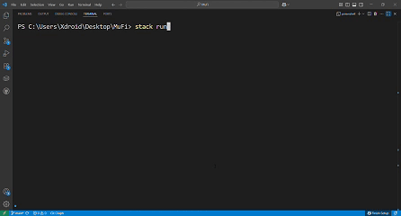

# MuFi: Music Fingerprinting and Recognition System

## Overview
MuFi is a Haskell-based music recognition system that identifies songs by generating and matching audio fingerprints. It processes audio input from files (with plans for real-time microphone capture), converts it to a frequency-domain spectrogram using Fast Fourier Transform (FFT), extracts unique fingerprints, and queries a SQLite database to display the matched song's title, artist, album, and a YouTube Music link. All potential matches with their match counts are also displayed in the console.

## Demo
Below are visual demonstrations of MuFi's functionality:

- **Console Output**: A screenshot of the program’s output showing the best match and potential matches.
  

- **Program Execution**: A GIF showing the process of running MuFi with a sample audio file.
  
  


## Features
- **Audio Input Processing**: Supports audio files (e.g., `.wav`, `.mp3`) via `ffmpeg`. Real-time microphone input is under development.
- **Signal Processing**: Implements FFT from scratch in Haskell to convert audio into spectrograms for analysis.
- **Fingerprint Generation**: Detects landmark peaks in time-frequency space and generates hash values from peak pairs, inspired by algorithms like Shazam.
- **Database Integration**: Stores song fingerprints and metadata in a SQLite database using the `sqlite-simple` library.
- **Output**: Displays the best-matched song's title, artist, album, and YouTube Music link, followed by a list of all potential matches with their match counts.
- **Planned Features**:
  - Real-time microphone input using `portaudio` or similar libraries.
  - Improved fingerprinting accuracy for noisy or low-quality audio.
  - Enhanced testing with diverse audio samples.

## Prerequisites
- **Haskell**: Install the Glasgow Haskell Compiler (GHC) and either Cabal or Stack (Stack is recommended for simpler dependency management).
- **FFmpeg**: Required for audio file processing.
- **SQLite**: Required for database operations (usually included with `sqlite-simple`).

## Installation
1. **Clone the Repository**:
   ```bash
   git clone https://github.com/AraNge/MuFi
   cd MuFi
   ```

2. **Install Haskell Dependencies**:
   Using Stack (recommended):
   ```bash
   stack setup
   stack install
   ```
   Or using Cabal:
   ```bash
   cabal update
   cabal install
   ```

3. **Install FFmpeg**:
   - **Windows**: Place `ffmpeg.exe` in the project directory (no additional installation or PATH modification required).
   - **Ubuntu/Debian**:
     ```bash
     sudo apt update
     sudo apt install ffmpeg
     ```
   - **macOS** (using Homebrew):
     ```bash
     brew install ffmpeg
     ```

## Usage
1. **Prepare Audio Input**:
   - Place audio files (e.g., `.wav`, `.mp3`) in the project directory.
   - Microphone input is not yet supported but is planned for future releases.

2. **Run the Program**:
   ```bash
   stack run
   ```
   Alternatively, if using Cabal:
   ```bash
   cabal run
   ```

3. **Output**:
   The program processes the audio, generates fingerprints, queries the database, and displays:
   ```
   Best match: Song Title (Artist: Artist Name, Album: Album Name)
   Link: https://music.youtube.com/watch?v=...

   All potential matches:
     81 matches: Song Title 1 (Artist: Artist 1, Album: Album 1)
     12 matches: Song Title 2 (Artist: Artist 2, Album: Album 2)
     12 matches: Song Title 3 (Artist: Artist 3, Album: Album 3)
     10 matches: Song Title 4 (Artist: Artist 4, Album: Album 4)
     10 matches: Song Title 5 (Artist: Artist 5, Album: Album 5)
      9 matches: Song Title 6 (Artist: Artist 6, Album: Album 6)
   ```

4. **Database Setup**:
   - The SQLite database is automatically initialized on first run.
   - To add sample songs, use the provided utility function within the program (refer to the project documentation for details).

## Development
- **Audio Processing**: Uses `ffmpeg` for file input. Microphone support is in progress using `portaudio` or `pulseaudio`.
- **Signal Processing**: Implements FFT from scratch in Haskell for spectrogram generation.
- **Fingerprinting**: Generates hashes from peak pairs in the spectrogram, following Shazam-like algorithms.
- **Database**: Uses `sqlite-simple` for lightweight storage and efficient querying of fingerprints and metadata.
- **Visual Assets**:
  - Screenshots and GIFs are stored in the `assets/` folder.
  - To update visuals, capture new screenshots or record program execution and convert to GIF using tools like `ffmpeg` or EZGIF. Save assets in `assets/` and update the README.

## Planned Features
- **Real-Time Microphone Input**: Enable live audio capture using `ffmeg`.
- **Improved Accuracy**: Enhance fingerprinting algorithms to handle noisy or low-quality audio.
- **YouTube Integration**: Automatically open YouTube Music search results for recognized songs (partially implemented).
- **Testing**: Expand test suite with diverse audio samples to ensure robustness.

## License
This project is licensed under the MIT License. See the `LICENSE` file in the repository for details.